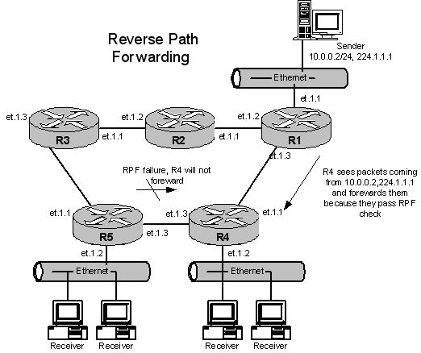
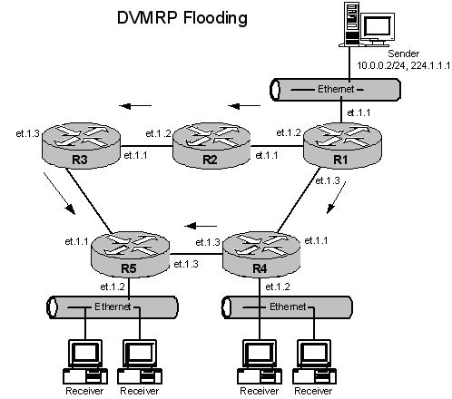
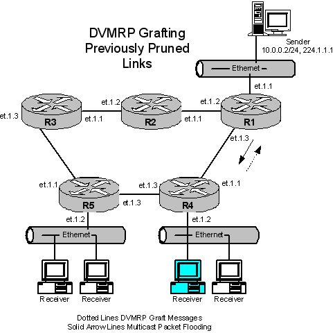

DVMRP Overview
==============

Reverse Path Forwarding
-----------------------

DVMRP uses Reverse Path Forwarding[1](#f1) (RPF) to
determine the best (shortest) path back to the source.  The router
examines all packets received as input to make sure that both source
address and interface are in the routing table.  It looks up the source
address in the forwarding table[2](#f2) and compares
that entry with the receiving entry (RFP check).  If the interface and
entry do not match or are not in the table, then the packets are
discarded.  If there is a match, then the router forwards the packets.

 
Flood & Prune
-------------

Periodically, the source performs what is known as flooding in order to
push datagrams downstream.  Initially, DVMRP routers assume that every
node on the connected subnets wants to receive data.  Along with the
datagrams, a packet called the ROUTE REPORT is transmitted (across a
time interval).  All the routes known by a given router is sent to all
adjacent routers.  By using IGMP[3](#f3), the routers
are aware of which hosts are connected to the subnets.  On receiving the
ROUTE REPORTS, a router selects the best adjacent router through which
it can reach the given source network.

After registering that router as the UPSTREAM NEIGHBOR, a DEPENDENCY is
expressed to the router for receiving packets.  Upon receiving this
DEPENDENCY, the receiving router registers the expressed DEPENDENCY as
its DEPENDENT DOWNSTREAM NEIGHBOR.

Hence, an optimal multicast spanning tree is constructed.  On receiving
a multicast packet, a router accepts that packet for forwarding if and
only if the packet is received from the UPSTREAM NEIGHBOR.  Otherwise,
it will be dropped.

Then, the list of the DEPENDENT DOWNSTREAM NEIGHBOR is verified and the
Lower Layer protocols forwards the packets to the specific neighbors.
If there are no DEPENDENT DOWNSTREAM NEIGHBORS, PRUNE MESSAGES are sent
to the UPSTREAM NEIGHBOR, requesting that the router should stop sending
packets from the specified source network for a specified amount of
time.

Thus, datagrams will no longer be transmitted along that path (cutting
down on the bandwidth being used).  After a prune interval, packets will
be flooded downstream again, along the shortest path trees.

If any other routers expresses some dependencies, GRAFT MESSAGES are
sent to that UPSTREAM NEIGHBOR.  Upon receiving an acknowledgement,
GRAFTACK MESSAGES are expected back.  On receiving a GRAFT MESSAGE from
a DOWNSTREAM NEIGHBOR, multicast packets will be sent on that interface.

The above procedures of Pruning and Grafting could initiate a similar
action in the receiving routers.  This means that unnecesary data
traffic will be reduced in the network, which is the advantage of DVMRP.

Footnotes
---------

<b id="f1">1)</b> *Reverse Path Forwarding:* the algorithm used to
determine the best route back to a source.  The router examines all
packets received as inputs to make sure that both source interface and
address are in the table.  It looks those up in the routing table and
compares them. If there is a match then accept the packets, else discard
them. [↩](#a1)

<b id="f2">2)</b> *Forwarding table:* the table maintained in a router
that lets it make decisions on how to forward packets.  The process of
building up the forwarding table is called routing.  Thus the forwarding
table is sometimes called a routing table. [↩](#a2)

<b id="f3">3)</b> *Internet Group Membership Protocol*, allows hosts on
a LAN to signal routers that they would like to subscribe to a multicast
group to receive a data stream.  Routers in turn use IGMP to determine
which interfaces to flood multicast packets to and which multicast
groups are on which interfaces. [↩](#a3)
